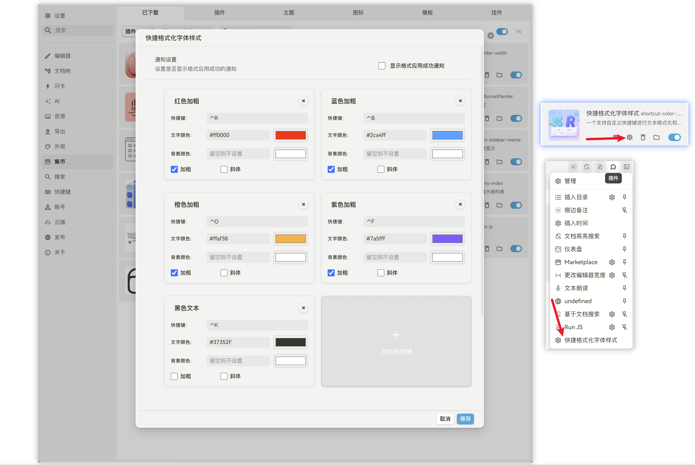

# 中文 | [English](README_EN.md)

# ⭐如果觉得好用，请给本插件Git仓库点个赞！！
# ⭐本插件GitHub地址：https://github.com/zhongjiahao-M/shortcut-color-plugin.git
# 快捷键变色插件

一个强大的思源笔记插件，让您可以使用自定义键盘快捷键快速为文本添加颜色和加粗格式。

## 截图

## 功能特色

- **跨平台兼容**: 完美支持 Windows 和 macOS 系统，自动适配不同平台的快捷键
- **自定义快捷键**: 创建个性化的文本格式化快捷键
- **颜色自定义**: 为文本设置任意前景色和背景色
- **样式组合**: 支持加粗、斜体、文字颜色、背景颜色的任意组合
- **智能快捷键捕获**: 点击输入框并按下组合键即可设置快捷键
- **停靠面板**: 提供便捷的停靠面板，快速访问所有快捷键
- **格式转换**: 一键转换旧格式为思源笔记标准格式
- **通知设置**: 可自定义是否显示格式应用成功的通知
- **响应式设计**: 在桌面端和移动端都能完美工作
- **撤销支持**: 所有格式化操作都支持 Cmd+Z (Ctrl+Z) 撤销

## 默认快捷键

插件会根据操作系统自动配置不同的快捷键：

### macOS 系统
- `⌃R` - 红色加粗文本
- `⌃B` - 蓝色加粗文本  
- `⌃O` - 橙色加粗文本
- `⌃P` - 紫色加粗文本
- `⌃K` - 黑色文本（不加粗）

### Windows 系统
- `Alt+R` - 红色加粗文本
- `Alt+B` - 蓝色加粗文本  
- `Alt+O` - 橙色加粗文本
- `Alt+P` - 紫色加粗文本
- `Ctrl+K` - 黑色文本（不加粗）

### 系统功能快捷键
- `⌃⇧C` (macOS) / `Alt+Shift+C` (Windows) - 格式转换功能
- `⌥⌘C` (macOS) - 打开停靠面板

## 使用方法

### 基本用法

1. 在思源笔记文档中**选中文本**
2. **按下快捷键**（例如 `⌃R` 或 `Alt+R` 设置红色加粗）
3. 文本将立即被格式化
4. 如需撤销，使用 `Cmd+Z`（或 `Ctrl+Z`）

### 停靠面板

1. 使用快捷键 `⌥⌘C` 打开停靠面板
2. 在面板中点击任意颜色按钮快速应用格式
3. 点击"添加新的"按钮创建自定义快捷键

### 自定义快捷键

1. 打开**设置** → **插件设置** → **快捷键变色**
2. 每个快捷键项目显示为一张卡片，包含：
   - **标题栏**: 直接点击编辑快捷键名称（可编辑的输入框）
   - **快捷键**: 显示当前快捷键，点击前往思源设置修改
   - **文字颜色**: 使用颜色输入框和加宽的颜色选择器设置文字颜色
   - **背景颜色**: 使用颜色输入框和加宽的颜色选择器设置背景颜色（留空则不设置）
   - **样式选项**: 勾选是否加粗或斜体（横向排列）
3. **添加快捷键**: 点击"添加快捷键"按钮
4. **删除快捷键**: 点击卡片右上角的"×"按钮
5. **保存设置**: 点击"保存"应用更改

### 格式转换功能

1. 使用快捷键 `⌃⇧C` (macOS) 或 `Alt+Shift+C` (Windows)
2. 插件会自动扫描当前文档中的旧格式
3. 将 `<strong style="color:#xxx">` 等格式转换为思源笔记标准格式
4. 转换完成后会显示转换数量

### 设置快捷键

1. **前往思源笔记设置** → **快捷键** → **插件** → **快捷格式化字体样式**
2. **找到对应的命令**（使用你设置的名称）并设置快捷键
3. **支持跨平台**: Windows 和 macOS 使用不同的修饰键
4. **要求**: 必须包含至少一个修饰键（Ctrl、Alt、Shift、Cmd）

### 支持的按键组合

- **修饰键**: `⌃` (Ctrl), `⌥` (Alt), `⇧` (Shift), `⌘` (Cmd)
- **常规键**: A-Z, 0-9
- **特殊键**: 空格、方向键、F1-F12、Esc、Enter、Tab 等
- **示例**: `⌘R`, `⌃⇧A`, `⌥F1`, `⌃⌥⇧K`

## 安装方法

### 从思源笔记集市安装
1. 打开思源笔记 → 设置 → 集市 → 插件
2. 搜索"快捷键变色"
3. 点击安装

### 手动安装
1. 下载插件包
2. 解压到 `{工作空间}/data/plugins/shortcut-color-plugin/`
3. 重启思源笔记
4. 在设置 → 集市 → 已下载中启用插件

## 使用技巧

- **按颜色分类**: 为相关内容类型使用相似颜色
- **一致的快捷键**: 选择容易记忆的组合键
- **测试组合**: 确保快捷键不与思源笔记的内置快捷键冲突
- **移动端友好**: 插件界面自适应移动设备屏幕
- **样式组合**: 充分利用加粗、斜体、文字颜色、背景颜色的组合效果
- **格式转换**: 定期使用格式转换功能保持文档格式的一致性
- **停靠面板**: 使用停靠面板快速访问常用格式
- **直观命名**: 给快捷键起一个容易理解的名称，方便管理

## 故障排除

**快捷键不工作？**
- 检查组合键是否与系统快捷键冲突
- 确保插件已启用
- 尝试重启思源笔记

**无法撤销格式？**
- 插件支持原生撤销（Cmd+Z/Ctrl+Z）
- 如果问题持续，尝试选中格式化的文本并应用其他格式

**设置无法保存？**
- 确保在更改后点击"保存"
- 检查思源笔记是否有插件目录的写入权限

## 许可证

MIT License

## 作者

zhongjiahao